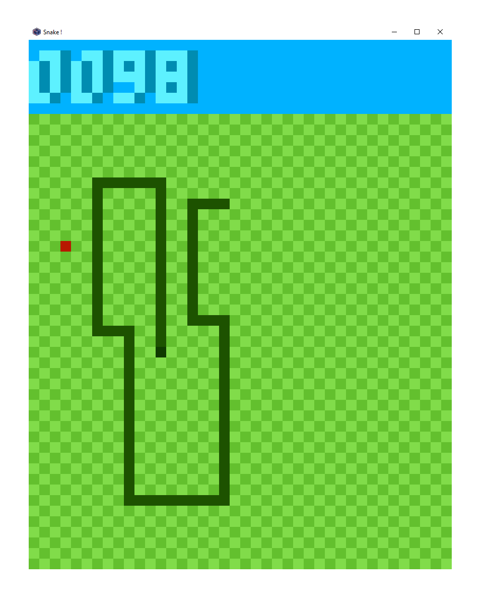

> This is a fork using the latest version of pyxel in date (and adpated the changes because recent versions of pyxel doesn't support this old version), adding some fancy features like shadow for scores and texts. The fancy grid too !   Used for a school project :)

# Snake #

## The classic game of snake implemented in [Pyxel](https://github.com/kitao/pyxel) ##

Try and collect the tasty apples without running
into the side or yourself.

Requires pyxel version >= 1.8.22.

Controls are the arrow keys: **←** **↑** **→** **↓**

**Q**: Quit the game
**R**: Restart the game

  

## Features ##

1. There is a snake
2. Snake death on hitting walls or self
3. Tasty apples that extend snake's length
4. There are sound effects
5. Score is kept

## Installation ##

1. Install [Python](https://www.python.org)
2. Install [Pyxel](https://github.com/kitao/pyxel) using their instructions
3. Clone or copy this repository
4. `python3 snake.py` at the command line
